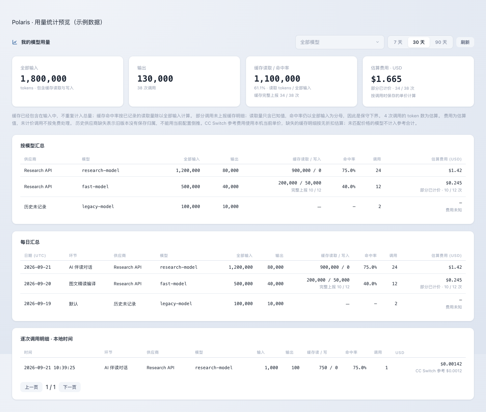
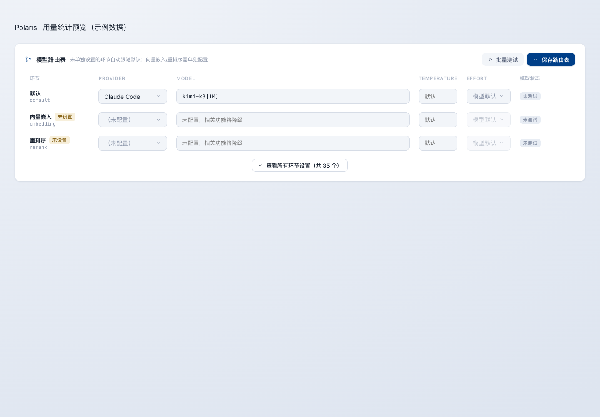
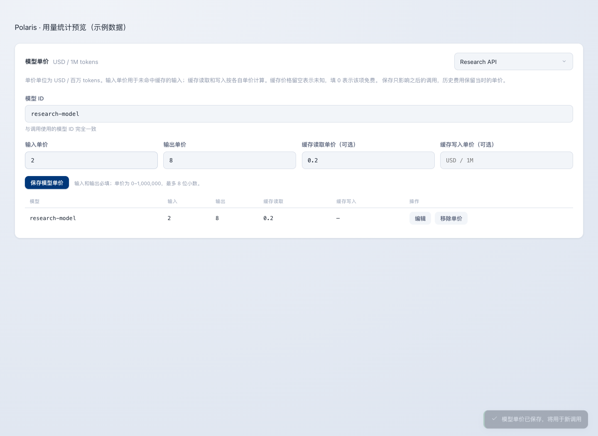
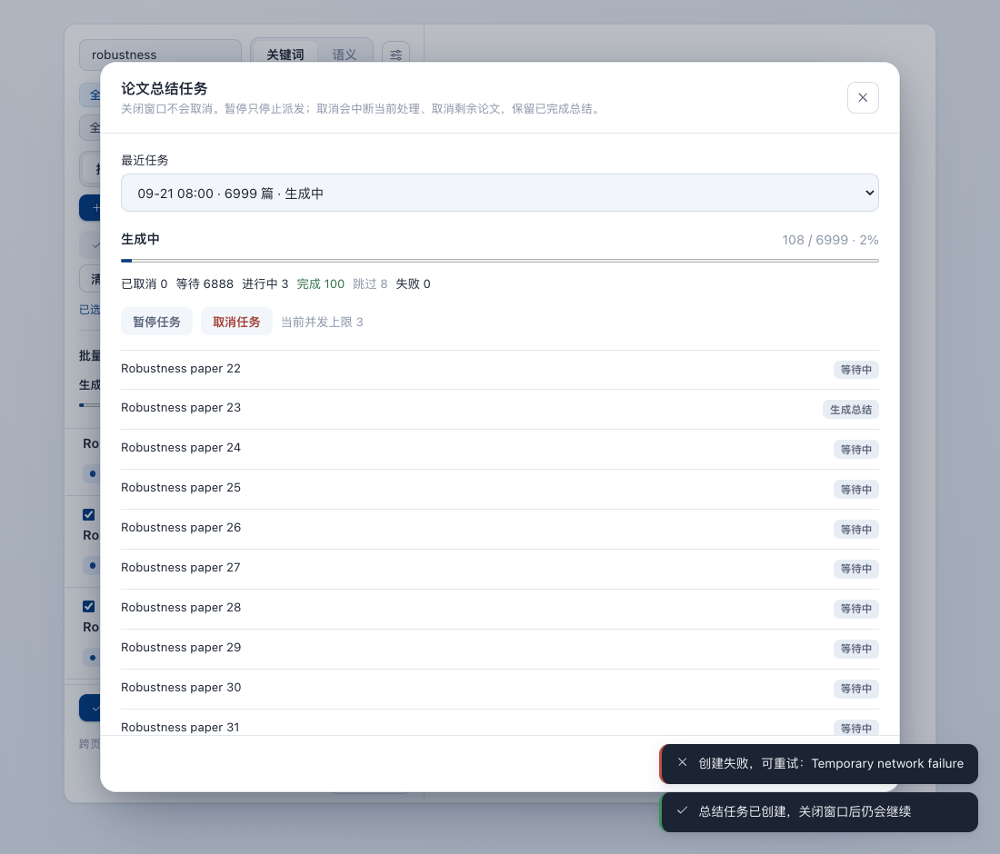

# LLM usage and cost accounting

Polaris records each model call in the server-side usage ledger and summarizes it by provider,
model, research stage, and day. The dashboard follows the useful parts of CC Switch's usage view:
input and output tokens, cache activity, model attribution, and estimated USD cost are visible in one
place. Polaris measures calls through its own `app/core/llm/` boundary; the Desktop app can also read
CC Switch's local model price table, without importing its request history or credentials.

## Where to find it

- Every signed-in user can open **Settings → Usage** (`/settings?tab=myusage`) to see their own calls.
- The deployment owner can open **Settings → Usage overview** (`/settings?tab=usage`) to see all
  recorded calls and filter the window to 7, 30, or 90 days.
- Every user can configure prices for providers in their own configuration scope under
  **Settings → Models & routing** (`/settings?tab=llm`), in the **Model pricing** card. For the
  deployment owner this is the shared deployment configuration. Prices are stored per provider and
  exact model ID, in USD per million tokens.



## Changing the model from the interface

In **Settings → Models & routing**, select the provider and model in the routing table, then choose
**Save routing**. A provider's model list only defines available choices. Unsaved edits are marked
and survive background refresh; incomplete routes are rejected without deleting the old route.
After a successful save, new calls use the saved model. Requests already sent retain their model,
and explicit stage overrides remain independent of the default.

When importing a local connection with **Set as default**, the confirmation defaults to replacing
that route. **Connection only** does not change routing. The usage overview also shows the current
default and provides a direct switch. Historical model names are never rewritten on a switch.



**Individual calls** lists each persisted request in local time, including seconds, newest first,
with model filtering and pages of 50. **Daily totals** still groups by UTC date.


## Token and cache semantics

`prompt_tokens` is the complete input reported for a call. It already includes cache reads and cache
writes, so the dashboard never adds either cache bucket to input a second time. Output is stored
separately as `completion_tokens`.

When a provider reports both cache buckets, Polaris records:

- **cache read tokens**: input served from the provider's prompt cache;
- **cache creation tokens**: input written to the cache for possible reuse;
- **cache hit rate**: cache read tokens divided by complete input tokens.

A missing cache field means “not reported,” not zero. The dashboard therefore shows cache reporting
coverage alongside the aggregate. A dash means the value is unknown; it does not mean that the call
had no cache hit. When coverage is partial, the read count contains known values only while the hit
rate still divides by all input; the displayed rate is therefore a conservative lower bound.

## Prices, costs, and snapshots

Each provider has an exact model-ID price table with four possible rates:

| Rate | Meaning |
| --- | --- |
| Input | Input that was neither read from nor written to cache |
| Output | Generated output |
| Cache read | Input served from cache |
| Cache creation | Input written to cache |

Input and output prices are required for a configured model. Cache prices are optional: leaving one
blank means unknown, while entering `0` explicitly means free. Polaris calculates one call as:

```text
fresh input = input - cache read - cache creation
cost = fresh input × input rate
     + output × output rate
     + cache read × cache-read rate
     + cache creation × cache-creation rate
```

Every term is divided by one million. If a required token bucket or rate is unavailable, or the
buckets are inconsistent, that call's cost remains unknown. Unknown calls are excluded from the
displayed USD sum and are shown through priced-call coverage; they are never silently counted as
free.

At call time Polaris saves both the computed `cost_usd` and a `pricing_snapshot` containing the exact
model ID, currency, and rates used. Editing a provider's prices affects future calls only, so a later
price change cannot rewrite historical costs.

### CC Switch prices on Desktop

**Import matching prices from local CC Switch** reads only `~/.cc-switch/cc-switch.db`'s
`model_pricing` table. It matches model IDs case-insensitively and removes context suffixes such
as `[1M]`; it does not substitute another model's prices. Existing provider-specific rates win.
The imported rates apply to future calls and are saved in their normal price snapshots.

The dashboard separately labels **CC Switch reference** estimates at the current local prices,
including for old unpriced calls. Unknown cache buckets receive no discount for this reference
estimate. Models without a matching rate are excluded. Reference estimates do not overwrite the
ledger's original supplier, cache counts or cost. Server deployments never inspect local CC Switch.



## Reported and estimated usage

Chat providers normally return token counts. When they do not, Polaris estimates input and output
from text length and marks the ledger row as estimated. Embedding calls are estimated from their input;
reranking uses provider-reported billed tokens when available and otherwise estimates them. The
dashboard reports how many calls contain estimated token counts so totals are not presented with
false precision.

Rows created before this accounting was introduced keep their original input and output totals. Their
provider, cache buckets, cost, and price snapshot remain unknown, and they are marked as estimated.

## Cancelling paper summary batches

Use **Cancel batch** next to the latest batch in the paper list, or inside **Summary tasks**.
Cancellation stops dispatch, interrupts in-flight processing when the worker observes the state,
and marks remaining items cancelled. Completed summaries are kept. Cancellation persists across
restarts and cannot be undone with Resume or Retry. Pause only stops new papers from starting.



## Design reference

The cache buckets, hit-rate formula, and four-rate price model follow the usage-accounting design in
[CC Switch](https://github.com/farion1231/cc-switch/tree/fdbe3a85b269ed40695ded5981b6ba8288d30ac3),
particularly its
[usage parser](https://github.com/farion1231/cc-switch/blob/fdbe3a85b269ed40695ded5981b6ba8288d30ac3/src-tauri/src/proxy/usage/parser.rs),
[cost calculator](https://github.com/farion1231/cc-switch/blob/fdbe3a85b269ed40695ded5981b6ba8288d30ac3/src-tauri/src/proxy/usage/calculator.rs),
and
[aggregate statistics](https://github.com/farion1231/cc-switch/blob/fdbe3a85b269ed40695ded5981b6ba8288d30ac3/src-tauri/src/services/usage_stats.rs).
Polaris keeps its own tenant attribution, stage attribution, and price snapshots because all model
calls already pass through its server-side LLM boundary.
