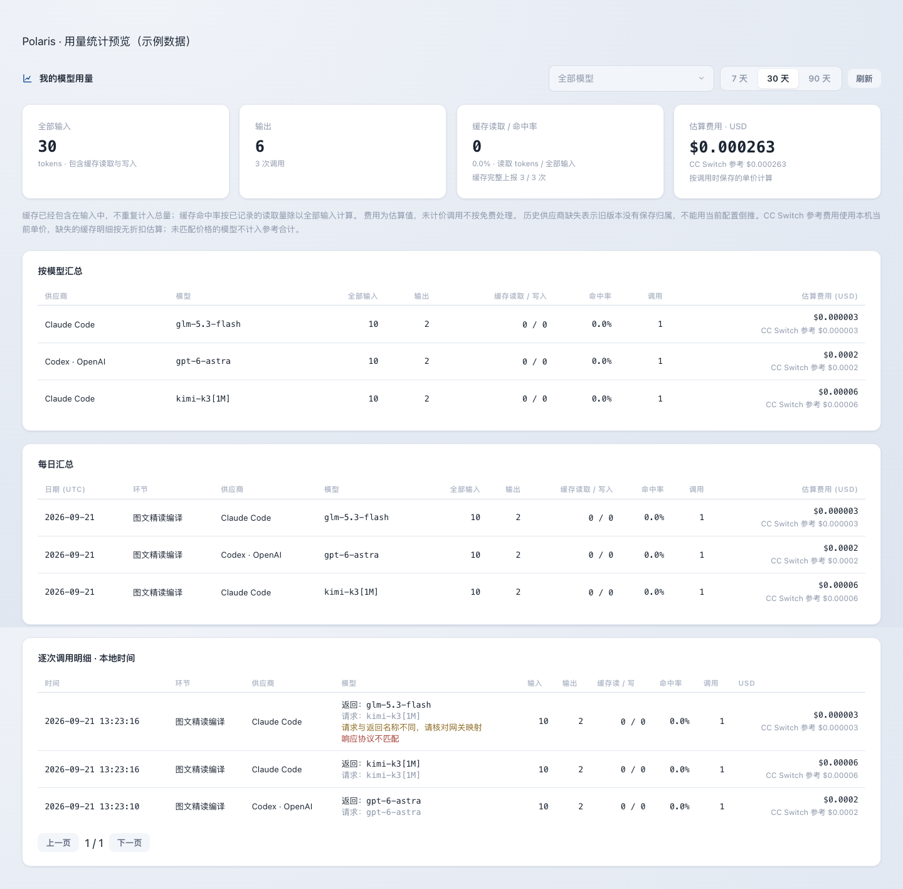
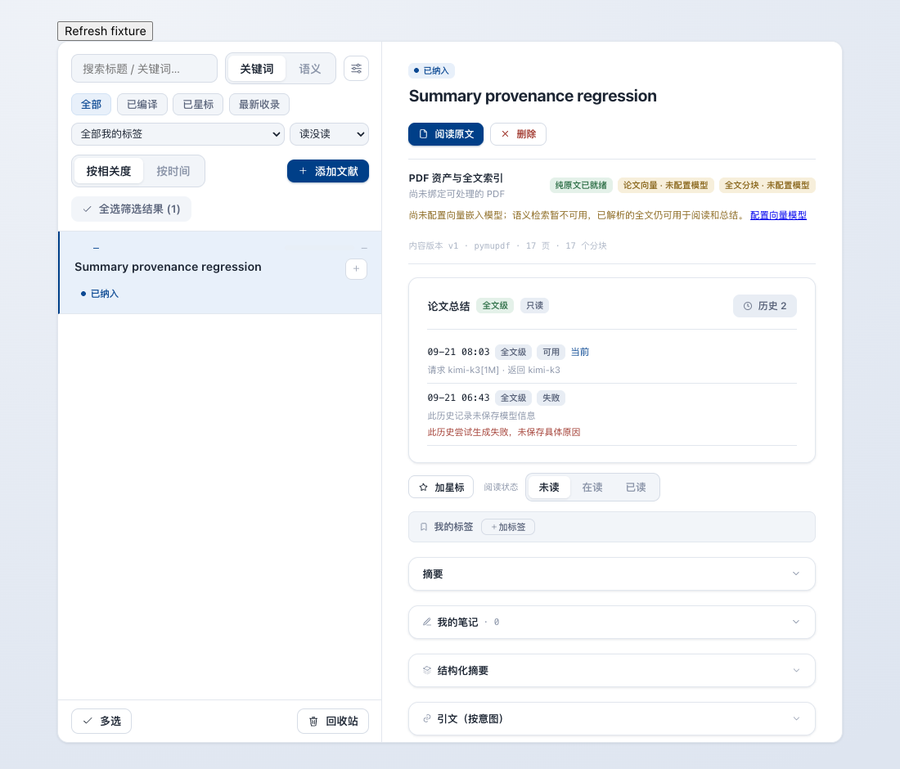
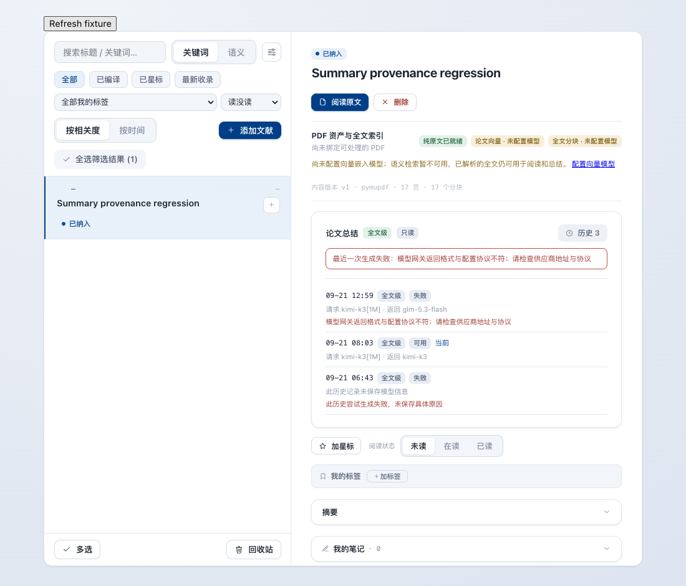

# Model response provenance and summary failure states

A saved `kimi-k3[1M]` route was sent to the configured Anthropic endpoint, but that
endpoint returned an OpenAI Chat Completions object identifying `glm-5.3-flash`.
Previously, Polaris interpreted the missing Anthropic `content` array as empty text,
estimated tokens using the wrong usage schema, and reported a generic summary failure.
The saved route was not the same field as the returned model shown by usage history.

The adapter now rejects that incompatible response explicitly. Reported token counts
remain accounted for using the response's usage format; incompatible responses have
no configured-price cost estimate. Each call retains its requested model, returned
model, and protocol error. The UI shows the requested model and configured pricing
basis alongside the response model. Historical configured-price estimates are not
rewritten; their pricing basis is now visible. CC Switch reference costs remain
separately labeled estimates, not billing confirmation.

Connectivity probes reject protocol mismatches and differing model names (ignoring
case and context-window suffixes). The fix does not silently switch provider protocols
or substitute GLM for a requested K3 model. A gateway which ignores the requested model
still requires an upstream configuration fix or a different endpoint.

Summary attempts now persist requested model and provider before preparation, and
response provenance before content validation. Protocol and empty-text errors receive
specific recovery codes; batches pause on these systemic failures. New nullable fields
are added by migration `eb9085b1ffc4`; historical absent provenance is left unknown.
Older failed attempts no longer display a failure banner above a newer successful
attempt, cancelled attempts are labeled separately, and SQLite UTC timestamps display
in local time.

Missing embedding configuration now leaves parsed text ready and marks vectors as
unconfigured. It does not fail the parsed document or prevent full-text summaries.
The UI also recognizes old `VECTOR_BUILD_FAILED / no embedding model configured`
records and explains that semantic search requires a separate embedding model.

## Validation

- Focused backend suites: protocol/usage provenance, summary lifecycle, content parsing,
  summary batches, admin model probes and usage; migration upgrade/downgrade/re-upgrade
  and a single Alembic head.
- Existing router and golden tests pass without changing golden snapshots.
- Frontend: 249 tests and TypeScript checks.
- Real browser -> FastAPI -> SQLite -> local HTTP provider: UI changes persist and
  reach the provider; an incompatible GLM response yields the protocol error and shows
  both model names with correctly counted usage and no configured-price estimate.
- Browser summary fixture: old failure below newer success, missing embedding guidance,
  and a newer protocol failure retaining both requested and returned models.
- Arm64 0.1.9 package: source match, signature, isolated setup, new migration, WAL,
  restart and Python environment switch. User settings and tasks are not modified.

## Synthetic UI evidence

