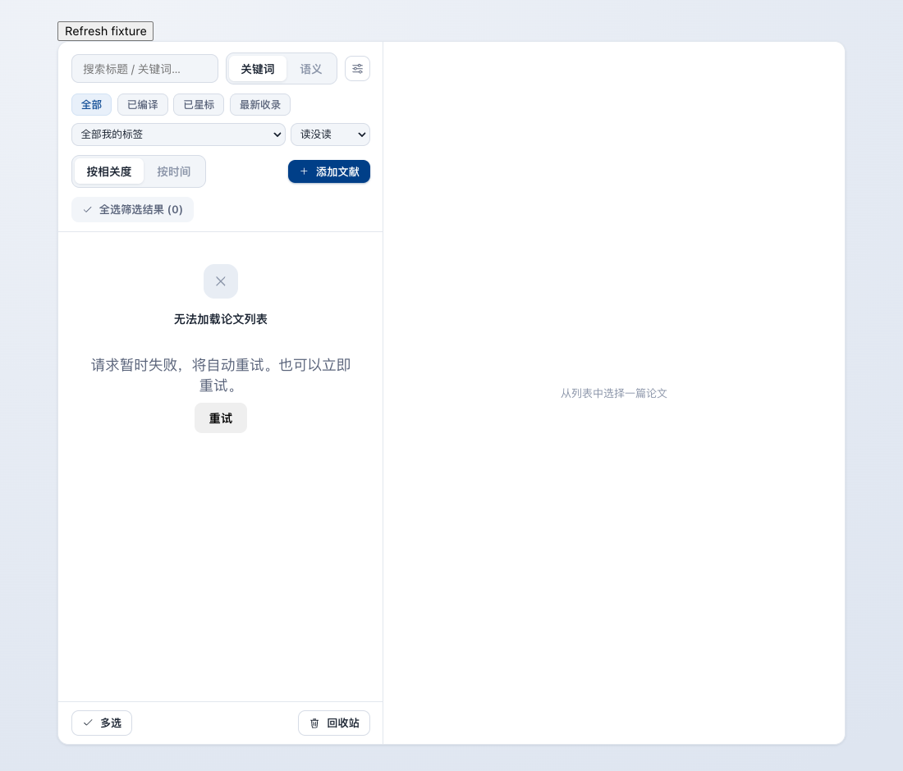
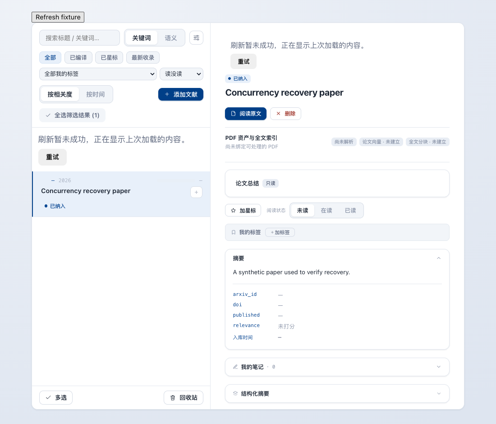

# Desktop paper reads during synchronization

Desktop SQLite previously used rollback journaling while Zotero synchronization and
summary workers shared the database. A sync could also hold its write transaction
while waiting for Zotero metadata or PDF references. A transient read failure left
paper lists and details in a persistent error state because their queries disabled
retries.

File-backed SQLite now enables WAL on the engine's first connection, before serving
requests, and gives each connection a 10-second busy timeout. The existing NullPool
and foreign-key enforcement remain. In-memory SQLite keeps its shared connection and
memory journal. PostgreSQL configuration is unchanged. WAL separates readers from the
single writer; it does not enable simultaneous writers. See [SQLite WAL documentation](https://www.sqlite.org/wal.html).

Zotero sync commits before metadata and attachment network calls. The 50-item commit
boundary includes unchanged and missing items. Paper reads retry transient failures
twice with backoff, then retry every ten seconds while the page is active. A visible
Retry button is also available. Background failures retain the last loaded contents;
404 and authorization failures do not display cached contents or retry automatically.
These recovery options apply to read queries, not task creation or other mutations.

Existing installations enable WAL on their next application launch after upgrading.
The running user application and its tasks are not restarted by the build workflow.

## Verification

- File SQLite: an active reader does not block a writer's commit, and a newly opened
  reader works during an unfinished write transaction.
- Existing DELETE-mode database: rows remain intact after enabling WAL; quick_check
  returns ok. In-memory connection sharing remains intact.
- Zotero: an independent writer can start during mocked metadata and attachment calls.
- Backend focused suites: 28 tests across SQLite capacity, Zotero local/original/import,
  and summary batches.
- Frontend: 246 tests and workspace type checks.
- Browser fixture: exhausted retries recover automatically; detail retry works;
  background failures retain contents; 404 hides inaccessible contents; zero mutations.
- Built arm64 app: isolated first installation, WAL/quick_check, second launch and
  switching Python environments. The packaged backend sources match the checkout.

## UI

Synthetic data only:

